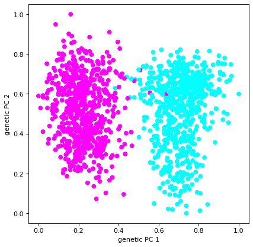
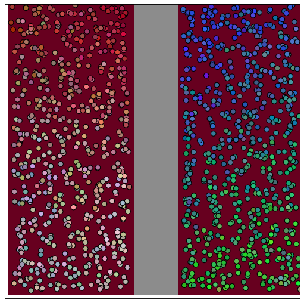
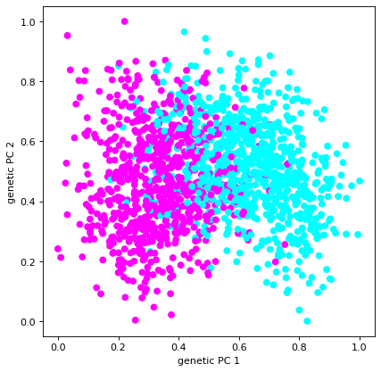
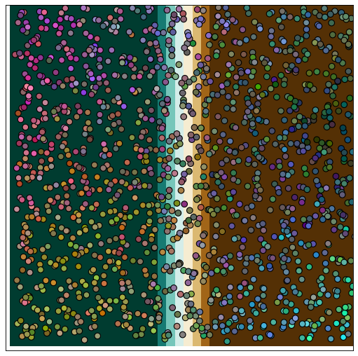

Questions for Geonomics (Part 2) Lab

1. How can you tell natural selection is acting on the population? Use evidence from the plots.

2. Before you run your simulation, state which parameter you are going to change and make a hypothesis about how you think it will affect the population. What do you expect to see in the plots if your hypothesis is correct?

Parameter:

Hypothesis:

3. After you run your simulation, state whether your hypothesis was supported or refuted. Use evidence from the plots to support your answer.

4. Repeat steps 2 and 3 for a second parameter.

Parameter:

Hypothesis:

Result:

5. Is drift acting in our simulations of selection? How do you know?

6. Below are the PCA plots from our neutral simulations where we simulated a barrier that divided the landscape in half and the PCA plots for our simulations with selection along a horizontal environmental gradient. Why do you think that the barrier resulted in more divergence in the PCA plot than selection?

Neutral simulation:

Selection simulation:

